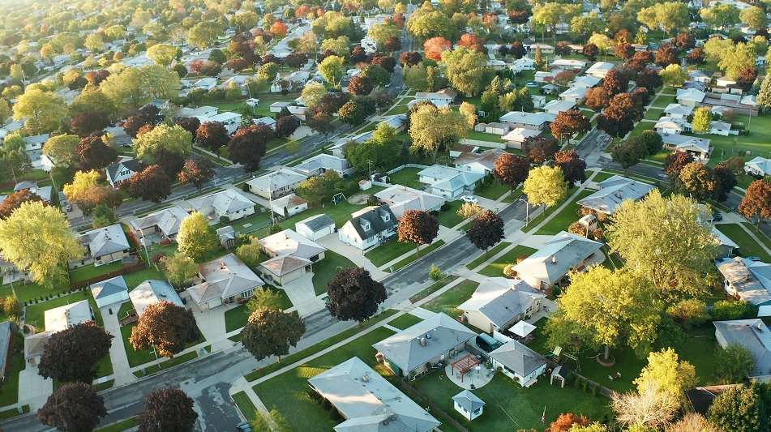

# Real Estate stakeholder engagement data analysis, a case study of King County, WA

This repository contains the code and resources used to build a Housing Price Prediction model for properties in King County. The model predicts the price of houses based on various features such as number of bedrooms, bathrooms, living area square footage, lot area square footage, condition, grade, and more.

## Overview

The Housing Price Prediction model was developed using Python. This README provides an overview of the steps taken to create the model.

## Introduction

King County is a county situated in Washington state, USA, with a population of 2,045,756 as of 2015. It spans an area of 5,975 square kilometers, including the city of Seattle, the largest city in Washington. Renowned for its urban areas, cultural attractions, and natural beauty such as views of Mt. Rainier, the Olympics, Cascades, and more.

King County plays a significant role in the economic and cultural life of the Pacific Northwest. It's known for housing global tech companies like Amazon, Microsoft, and Starbucks, making it a technological hub in the region.

## Problem Statement

The most common reasons for selling houses in KC are recouping investments and job relocation.For people relocating to other states one needs to dispose the houses quickly but still getting to know what factors affect pricing within KC. Some even have a problem where they are not aware when are the best periods to sell the houses and some dont understand the budget their potential buyers might have. Some end up taking a long time to sell their houses due to the fact of not getting the price and timing right.

## Business Understanding

The most populated area in Washington state, King County, offers a lucrative real estate investment hub due to its scenic views and the demand for housing in the city of Seattle. The dynamic real estate market mirrors the county's rapid growth driven by tech giants, resulting in significant attention and demand for housing.

## Data Understanding

The dataset provides detailed attributes related to houses in King County. The 'id' serves as a unique identifier, while 'date' shows the sale date. 'Price' is the target variable, and features like 'bedrooms,' 'bathrooms,' 'sqft_living,' 'floors,' 'waterfront,' 'view,' 'condition,' 'grade,' and others provide comprehensive insights into the properties.

## Objectives

The study aims to identify the factors influencing house prices in King County. Specific objectives include determining the optimal months for selling and buying houses for profitability, analyzing construction periods, identifying prevalent house types, and understanding the common budget range for buyers.

## Libraries Used
Python  
Matplotlib  
Scikit-learn  
Seaborn 
Pandas 
Numpy  
Statsmodels  

### Data Serialization

The dataset used for this project contains a variety of features including the number of bedrooms, bathrooms, square footage of living area, lot area, condition, grade, and many others. 

### Exploratory Data Analysis (EDA)

This is an analysis where we look into the individual componenets of the data. The EDA process aims to provide an initial understanding of the data's distribution, central tendencies, and variations, laying the foundation for more in-depth analyses and modeling. It is a critical phase in the data analysis pipeline that helps uncover patterns, relationships, and potential factors influencing house prices in King County.

It was conducted to gain insights into the dataset. This involved:
- Visualizing data distributions.
- Identifying missing values.
- Analyzing correlations between features.
- Exploring the relationships between price and other features.

### Preprocessing

Data preprocessing was performed to ensure the data was ready for regression. This included:

- Handling outliers in the data.
- Preparing the data and fitting the model.

## Regression Analysis

The analysis comprises several regression models:

1. **Baseline Model**: Initial regression model to establish a starting point for the analysis.  
The presented regression model aims to predict housing prices (price) in King County based one independent variable: sqft_living. The model's overall performance is evaluated using the R-squared value, which indicates that approximately 50% of the variance in housing prices can be explained by these predictors. The F-statistic, with a high value of 15680 and a corresponding p-value of 0.00, suggests that the overall model is statistically significant, indicating the independent variable is related to the housing prices.
   
2. **Multiple Regression Model 1**: Enhanced regression model integrating additional features and refinements. 
The presented regression model aims to predict housing prices (price) in King County based on several independent variables: bedrooms, bathrooms, sqft_living, sqft_lot and floors. The model's overall performance is evaluated using the R-squared value, which indicates that approximately 48% of the variance in housing prices can be explained by these predictors. The F-statistic, with a high value of 2908 and a corresponding p-value of 0.00, suggests that the overall model is statistically significant, indicating that at least one of the independent variables is related to the housing prices.
   
3. **Multiple Regression Model 2**: Further improved regression model with additional adjustments and interpretations. 
From our data we have found out that factors that significantly affect pricing includes location, year built, bedrooms, bathrooms, sqft living, sqft lot and floors. Our prediction model however is 72% accurate when predicting price.

## Interpreting Coefficients

In each regression model, coefficients are interpreted to understand the impact of different features on house prices. This section elaborates on the insights gained from these coefficients.

## Conclusions

In summary, our predictive model explains roughly 72% of the fluctuation observed in house prices, indicating a robust predictive capability. Key determinants, such as square footage, location, view, and waterfront presence, significantly influence property valuations. However, it's crucial to acknowledge that real estate is affected by numerous dynamic variables, making achieving 100% accuracy in predicting house prices quite challenging. Despite this, the performance of our model is promising and offers assistance in estimating property values within King County, serving as a dependable method for both buyers and sellers. While reliable, it's advisable to complement the model with additional information for more accurate pricing decisions.

## Recommendations

1. Considering our analysis multi storey buildings tend to influence the prices positively by 9.56%. When one wants to sell a house with multiple storeys this can be a good increasing factor to consider.
2. Since bedrooms affect prices negatively, one can try and advertise the extra bedrooms as extra office space or guest room so as to draw better pricing rather than just highlight it as a bedroom.
3. Bathrooms can be added as a selling point since it affects price positively. This can be advertised as a convenience and luxury for a potential buyer.
4. Since sqft living positively affects price but not quite significantly one can advertise by putting emphasis on the houses layout,design and functionality of the living space.
5. Most sales should be done within April to July which coincide with warmer weather conditions and also tax refunds tend to be refunded on May 1 for the first half of the year where majority of people tend to use the refund cheques as a source for downpayment for the houses. For more information https://www.americanfinancing.net/lifestyle/ways-to-use-tax-refund-for-homeownership .
6. When investing towards housing in KC the best product mix would be a blend of 4.0 bedrooms and 2.5 bathrooms. This is due to the fact that it is most popular mix from our analysis. The perfect time would be to sell this blend in June.
7. Demand is heavily present for houses that range from 300-400k. This is the budget most people in KC county have when looking for houses.
8. The best time to buy a house would be between November to February. Due to it being a cold season there is a reduction in demand for the houses in KC. This coincides with a decrease in price for the houses in this period.

## Next Steps

More data collection on demographies like age, family size, income and gender would be good to build up on our models and give better insights towards home ownership in KC.

## Contributors

- [Mwangi Wambugu](https://github.com/MwangiWambugu)
- [Brian Orwa](https://github.com/brianorwa)
- [Julius Kagety](https://github.com/jkagety)
- [Dennis Kimani](https://github.com/dennismathu)
- [Amina Hagi](https://github.com/aminahagi)
- [Emmanuel Rono](https://github.com/marttech26)
